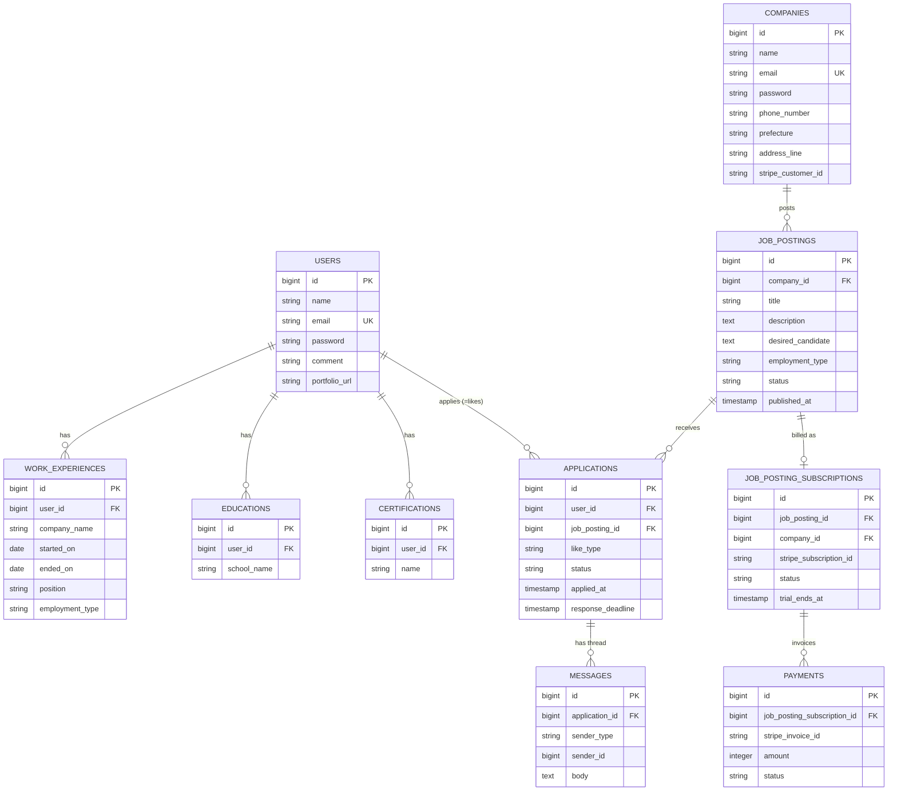

# DB設計(v2・全面再設計)

`REQUIREMENTS.md` の内容をもとにしたテーブル設計。DBはPostgreSQLを想定。

前バージョンからの主な変更点は本ドキュメント末尾の「5. 前バージョンからの変更点」を参照。

## 1. ER図

`notifications` と パスワードリセット用テーブルは、Laravel標準テーブルを使うため上記ER図には含めていない(詳細は「2. テーブル定義」末尾および「4. 補足」を参照)。

## 2. テーブル定義

### users(求職者)
| カラム | 型 | 制約 | 備考 |
|---|---|---|---|
| id | bigint | PK | |
| name | string | not null | |
| email | string | unique, not null | ログインID |
| password | string | not null | |
| comment | string(200) | nullable | 自己紹介コメント |
| portfolio_url | string | nullable | GitHub・個人ポートフォリオサイト等のURL |
| created_at / updated_at | timestamp | | |

### companies(企業。1社1アカウント)
| カラム | 型 | 制約 | 備考 |
|---|---|---|---|
| id | bigint | PK | |
| name | string | not null | 会社名 |
| email | string | unique, not null | ログインID |
| password | string | not null | |
| description | text | nullable | 会社概要 |
| phone_number | string | nullable | |
| prefecture | string | nullable | 所在地(都道府県) |
| address_line | string | nullable | 所在地(市区町村以下) |
| stripe_customer_id | string | nullable, unique | Stripe顧客ID(Cashier用) |
| created_at / updated_at | timestamp | | |

所在地は検索・絞り込みには使わない(job_postings.prefectureとは無関係)ため、`prefecture`と`address_line`を分けるのは表示上の整形のためのみ。Webサイトは要件に明記がないため今回は含めない(「6. 未決事項」参照)。

### work_experiences(求職者の職歴)
| カラム | 型 | 制約 | 備考 |
|---|---|---|---|
| id | bigint | PK | |
| user_id | bigint FK → users.id | not null | |
| company_name | string | not null | |
| started_on | date | not null | 在籍開始年月 |
| ended_on | date | nullable | 在籍終了年月。nullは在籍中を表す |
| position | string | nullable | 役職 |
| employment_type | string(enum) | not null | `full_time` / `part_time` / `contract`(job_postingsと同じ区分) |
| created_at / updated_at | timestamp | | |

表示順は`started_on`の降順。0件でもよい(新卒・未経験者を想定)。

### educations(求職者の学歴)
| カラム | 型 | 制約 | 備考 |
|---|---|---|---|
| id | bigint | PK | |
| user_id | bigint FK → users.id | not null | |
| school_name | string | not null | |
| created_at / updated_at | timestamp | | |

### certifications(求職者の資格)
| カラム | 型 | 制約 | 備考 |
|---|---|---|---|
| id | bigint | PK | |
| user_id | bigint FK → users.id | not null | |
| name | string | not null | 資格名のみ(取得年月は管理しない) |
| created_at / updated_at | timestamp | | |

- unique制約: `(user_id, name)`(同一資格の重複登録を防止)

### job_postings(求人)
| カラム | 型 | 制約 | 備考 |
|---|---|---|---|
| id | bigint | PK | |
| company_id | bigint FK → companies.id | not null | |
| title | string | not null | |
| description | text | not null | 職務内容 |
| desired_candidate | text | nullable | 求める人材像(応募資格・歓迎スキル等) |
| employment_type | string(enum) | not null | `full_time` / `part_time` / `contract` |
| prefecture | string | not null | 勤務地。検索の絞り込み条件 |
| salary_min | integer | nullable | 月給(円)。表示のみ、絞り込みには使わない |
| salary_max | integer | nullable | 月給(円)。表示のみ、絞り込みには使わない |
| status | string(enum) | not null, default `draft` | `draft` / `published` / `unpublished` / `closed`(下記参照) |
| published_at | timestamp | nullable | 初回公開日時。無料期間の起算点 |
| created_at / updated_at | timestamp | | |

`status` の意味:
- `draft`: 作成済み・未公開
- `published`: 公開中(検索結果に表示)
- `unpublished`: 支払い未了により自動非公開(表示されないが企業側で確認・支払い登録可能)
- `closed`: 企業が募集終了(恒久的に非表示)

検索の絞り込み対象は「キーワード(`title`/`description`) + `prefecture` + `employment_type`」の3つのみ(要件4.2)。`salary_min`/`salary_max`は表示専用。

### applications(応募 = 求職者からの「いいね」)
求職者が求人に「いいね」した時点でレコードが作成される。「いいね」は求職者の応募意思そのものであり、`likes`という別テーブルは持たない。

| カラム | 型 | 制約 | 備考 |
|---|---|---|---|
| id | bigint | PK | |
| user_id | bigint FK → users.id | not null | |
| job_posting_id | bigint FK → job_postings.id | not null | |
| like_type | string(enum) | not null, default `standard` | `standard`(通常のいいね) / `super`(スーパーいいね) |
| status | string(enum) | not null, default `applied` | `applied` / `matched` / `expired`(下記参照) |
| applied_at | timestamp | not null | 求職者が「いいね」した日時 |
| response_deadline | timestamp | not null | `applied_at` + 7日。企業の反応期限(`like_type`によらず共通) |
| company_responded_at | timestamp | nullable | 企業が「気になる」を押した日時 |
| created_at / updated_at | timestamp | | |

- unique制約: `(user_id, job_posting_id)`(同一求人への重複応募・重複いいねを防止)

`status` の意味:
- `applied`: 求職者がいいね(応募)した直後。企業の反応待ち
- `matched`: 企業が7日以内に「気になる」を押し、マッチ成立。メッセージ開始可能
- `expired`: 7日以内に企業の反応がなく自動的に不成立(バッチ処理で更新)

マッチ成立後の選考プロセス(書類選考・面接・内定など)はステータスとして管理しない(要件4.2「選考ステータス管理機能は設けない」)。そのためステータス変更履歴テーブルは持たない。

**月間上限(通常10件/スーパー1件、月初リセット)の数え方**: 専用のカウンタテーブルは設けず、`applications`を`user_id` + `like_type` + `applied_at`(当月分)でカウントするクエリで判定する。カウンタを別テーブルで持つと応募の取消等が発生した際に同期ズレのリスクがあるため、都度集計する方針とする。

### messages(応募単位のメッセージスレッド)
| カラム | 型 | 制約 | 備考 |
|---|---|---|---|
| id | bigint | PK | |
| application_id | bigint FK → applications.id | not null | |
| sender_type | string | not null | `user` / `company` |
| sender_id | bigint | not null | |
| body | text | not null | |
| read_at | timestamp | nullable | |
| created_at | timestamp | | |

面接日程調整は構造化された機能(候補日提示→確定)を持たず、マッチ成立後の`messages`でのやり取りに委ねる。そのため`interview_schedules`/`interview_schedule_slots`は持たない。

### job_posting_subscriptions(求人ごとのサブスクリプション課金)
| カラム | 型 | 制約 | 備考 |
|---|---|---|---|
| id | bigint | PK | |
| job_posting_id | bigint FK → job_postings.id | not null, unique | 1求人につき1件 |
| company_id | bigint FK → companies.id | not null | 検索用に非正規化 |
| stripe_subscription_id | string | nullable, unique | Stripe側のsubscription ID(Cashierの`subscriptions.stripe_id`と一致) |
| stripe_price_id | string | nullable | 月額1,000円のPrice ID |
| status | string(enum) | not null, default `trialing` | `trialing` / `active` / `past_due` / `canceled` / `unpaid`(Stripeのステータスに準拠) |
| trial_ends_at | timestamp | not null | `published_at` + 14日 |
| current_period_start | timestamp | nullable | |
| current_period_end | timestamp | nullable | |
| created_at / updated_at | timestamp | | |

### payments(請求履歴)
| カラム | 型 | 制約 | 備考 |
|---|---|---|---|
| id | bigint | PK | |
| job_posting_subscription_id | bigint FK → job_posting_subscriptions.id | not null | |
| stripe_invoice_id | string | unique, not null | |
| amount | integer | not null | 円単位(1000) |
| status | string(enum) | not null | `paid` / `failed` / `pending` |
| paid_at | timestamp | nullable | |
| created_at | timestamp | | |

### notifications(アプリ内通知。Laravel標準テーブルを使用)
| カラム | 型 | 制約 | 備考 |
|---|---|---|---|
| id | uuid | PK | |
| type | string | not null | 通知クラス名 |
| notifiable_type | string | not null | `App\Models\User` / `App\Models\Company` |
| notifiable_id | bigint | not null | |
| data | json | not null | 通知内容(メッセージ, リンク等) |
| read_at | timestamp | nullable | |
| created_at / updated_at | timestamp | | |

### パスワードリセット用テーブル(要件4.1「パスワードリセット」に対応)
`users`と`companies`は別Sanctumガードの別テーブルであり、同じメールアドレスが両方に存在しうるため、Laravel標準の単一`password_reset_tokens`(emailキーのみで判定)をそのまま共用すると、求職者と企業でメールアドレスが一致した場合に誤って混同するリスクがある。そのためガードごとにテーブルを分離する。

| テーブル名 | 対象 | カラム |
|---|---|---|
| `password_reset_tokens` | users | `email`(PK), `token`, `created_at` |
| `company_password_reset_tokens` | companies | `email`(PK), `token`, `created_at` |

## 3. インデックス方針

- `job_postings(status, prefecture, employment_type)`(検索の絞り込み)
- `applications(user_id, like_type, applied_at)`(月間上限のカウント用)
- `applications(job_posting_id)`
- `messages(application_id, created_at)`
- `work_experiences(user_id)`
- `educations(user_id)`
- `certifications(user_id)`

## 4. 補足

- **求職者/企業の認証分離**: `users` と `companies` は別テーブル・別Sanctumガードで管理する(1社1アカウントのため `companies` がそのままログイン主体を兼ねる)。
- **メッセージの送信者**: `messages.sender_type` / `sender_id` は簡易ポリモーフィック。Eloquentの`morphTo`を使用してもよい。
- **課金と公開状態の連動**: `job_postings.status` はバッチ処理(Laravel Scheduler)や Stripe Webhook(`invoice.payment_failed` 等)から更新する。`job_posting_subscriptions.status` がStripe側の実体、`job_postings.status` はアプリの表示制御用という役割分担。
- **Laravel Cashierとの関係**: 決済はLaravel Cashierで実装する。Cashierは`Billable`トレイトを持つモデル(=`Company`)を1 Stripe顧客として扱い、`name`(サブスクリプションの識別名)を分けることで1顧客が複数サブスクリプションを持てる。求人ごとの課金は `name = "job_posting:{job_posting_id}"` のようなサブスクリプション名で管理し、Cashier標準の`subscriptions`/`subscription_items`テーブルを実体として使う。`job_posting_subscriptions`テーブルは、その中のどのCashierサブスクリプションがどの求人に対応するかを紐付け、アプリ側の検索・表示用に非正規化した薄いラッパーという位置づけ。
- **マッチ失効バッチ**: Laravel Schedulerで定期的に `applications` を走査し、`status = applied` かつ `response_deadline` を過ぎているレコードを `status = expired` に更新する。
- **支払い方法の登録タイミング**: 求人投稿時にカード登録は必須にしない。無料期間中(`trial_ends_at`まで)は`stripe_subscription_id`が未設定のまま`status = trialing`で公開できる。期限が近づいたら`notifications`でリマインドし、`trial_ends_at`時点でカード未登録・決済失敗なら`job_posting_subscriptions.status = unpaid`、`job_postings.status = unpublished`にバッチ/Webhookで更新する。

## 5. 前バージョンからの変更点

要件定義の見直しに合わせてゼロから設計し直した結果、以下の実質的な変更がある(単なる書き直しではなく、要件との突き合わせで見つかった漏れ・過剰設計の是正)。

| 変更 | 内容 | 理由 |
|---|---|---|
| `job_postings.job_type` は追加後、最終的に削除 | 旧設計にはこのカラム自体が存在せず、一度は欠落是正として追加したが、その後「職種」自体を求人の管理項目から外す判断をしたため最終的に削除 | 要件4.2から「職種」表示の記載自体を削除したため不要に |
| `applications.like_type` を追加 | 通常いいね/スーパーいいねを区別するカラムがなかった | 要件4.2の月間上限(通常10件/スーパー1件を別枠管理)を実装できなかった(欠落) |
| `job_postings.work_style` / `position_level` / `min_experience_years` を削除 | 旧設計にあったが要件に一切記載がない項目 | 過剰設計。必要になれば要件を確認した上で追加する |
| `job_posting_skills`(求人への必須スキル)を削除 | 旧設計にあったが要件は求職者側のスキルのみ言及 | 過剰設計。求人と求職者のスキルマッチングは要件に含まれない |
| `application_status_histories` を削除 | 旧設計にあったが要件4.2は明確に「選考ステータス管理機能は設けない」と規定 | 要件と矛盾する機能を実装してしまっていた |
| `password_reset_tokens` / `company_password_reset_tokens` を追加 | 旧設計には一切存在しなかった | 要件4.1「パスワードリセット」を満たすテーブルが欠落していた |
| `users.birthdate` を削除 | 旧設計にあったが要件のプロフィール項目(氏名・自己PR・スキル)に含まれない | 過剰設計 |

## 6. 未決事項

- `employment_type` / `like_type` / `status` 系のenumをDB上で `enum型` にするか、Laravel側でバリデーションする `string + check制約` にするか(PostgreSQLのenum変更のしにくさを考慮すると後者が無難)
- `companies` にWebサイトURLを追加するか(電話番号・所在地は追加済み)。要件には明記がないため今回は含めていない
